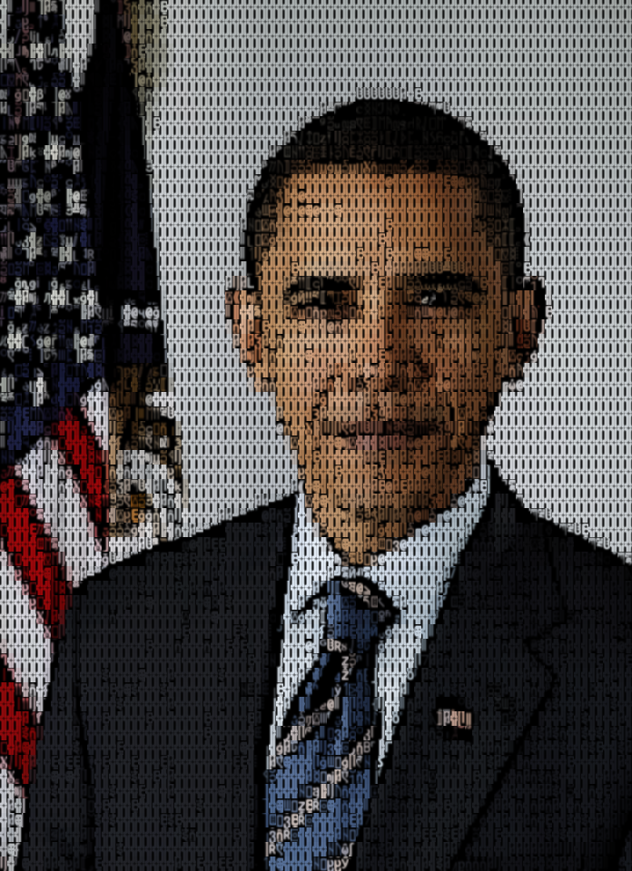
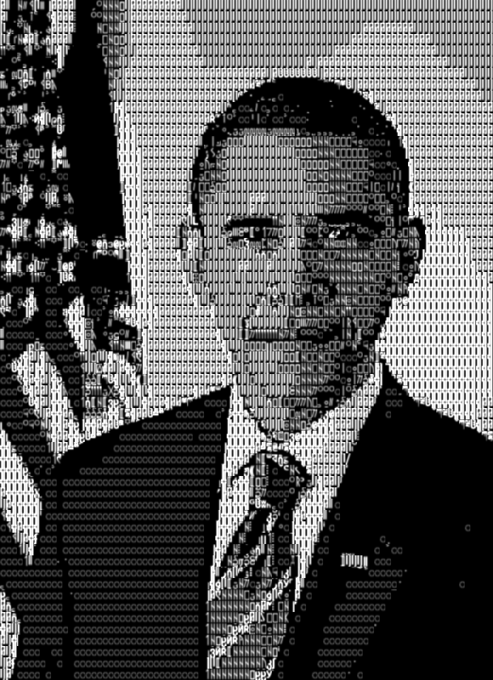
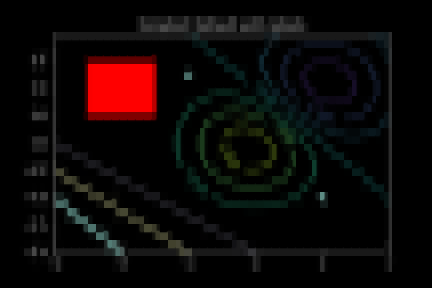
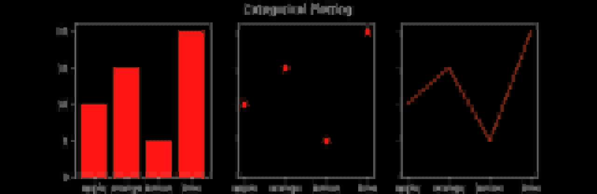
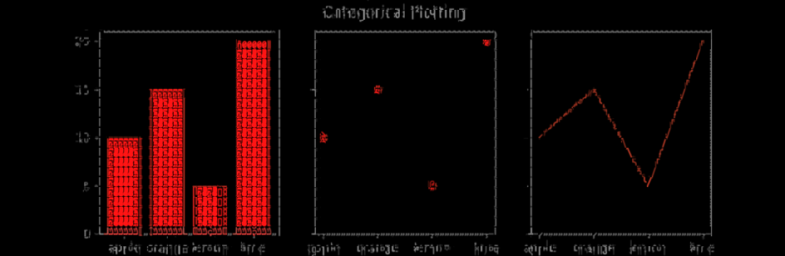
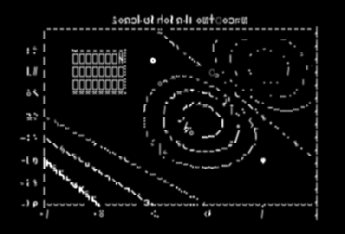
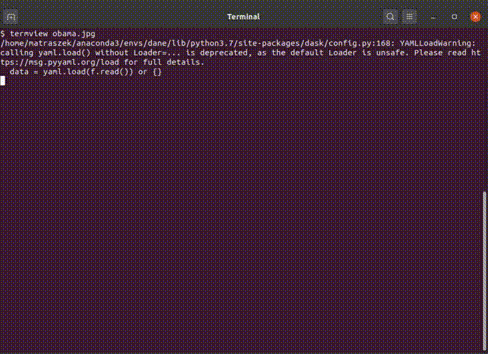

# img2unicode
A tool to display images as Unicode in your terminal.
The library is currently optimized for Ubuntu Mono font rendered by libvte (Gnome Terminal, Terminator etc.) i.e. it works on stock Ubuntu.

````bash
pip install img2unicode
imgcat image.jpg
````

## Installation

You can install img2unicode via pip from PyPI:

```sh
$ pip install img2unicode
```

If you want to utilize `FastGammaOptimizer`,
install the optional n2 dependency:

```sh
$ pip install 'img2unicode[n2]'
```

Note that `ExactGammaOptimizer` is more portable, yet much slower.
Use `BestGammaOptimizer` alias to choose automatically between these two.

## Usage

```python
import img2unicode
# Use Unicode Block Elements
optimizer = img2unicode.FastGenericDualOptimizer("block")
renderer = img2unicode.Renderer(default_optimizer=optimizer, max_h=60, max_w=160)
renderer.render_terminal('examples/obama.jpg', 'obama-block.txt')

# Pair Renderer to Optimizer
optimizer = img2unicode.FastGammaOptimizer("no_block") # Or ExactGammaOptimizer
renderer = img2unicode.GammaRenderer(default_optimizer=optimizer, max_h=60, max_w=160)
renderer.render_terminal('examples/obama.jpg', 'obama-noblock.txt')

pil_image = renderer.prerender('examples/obama.jpg')
pil_image.save('obama-rendered.png')

# Use own mask: it may be name from common masks (see source), slice or numpy bool array.
ascii_optimizer = img2unicode.FastGammaOptimizer(slice(32, 127), use_color=False)
# Get the characters, foreground and background colors. Use non-default optimizer.
chars, fores, backs = renderer.render_numpy('examples/obama.jpg', optimizer=ascii_optimizer)
```

## Optimizers
Here is a quick comparison of the most usable optimizers:

| FastQuadDualOptimizer() |  FastGenericDualOptimizer ("block") | FastGammaOptimizer (charmask="no_block") | FastGammaOptimizer (charmask="no_block", use_color=False) |
| --- | --- | --- | ---
| Choses from 4-pixel characters like ▚ | Optimizes foreground/background for whole [Unicode Block Elements](https://en.wikipedia.org/wiki/Block_Elements). | Optimizes foreground color for all Unicode rendered in single cell. | Same, but does't use terminal colors. |
|  |  |  |  |
|  |  |   |   |
| Good color representation | Good color and crisper image | Crisp edges with black | Pure art, no color. |
| Foreground & background    | Foreground & background | Just foreground | No color |
| ~5Hz | ~4Hz | ~1Hz | ~2Hz |
| O(S*T), T=7 | O(S*T), T=24 | O(S*log(T)), T=5553 | O(S*log(T)), T=5553 |

Where `S` is the number of 16x8 pixel samples to optimize for and `T` is the number of templates.

## See it yourself

Use the included `termview` script to browse images with all renderers. First, install the optional dependency:

```sh
$ pip install 'img2unicode[termview]'
```

then execute:

```bash
termview examples/obama.jpg
```


or use `imgcat` to display an image in your terminal:

```bash
imgcat examples/obama.jpg
```


## More samples
To see how other optimizers compare to each other, see [examples/README.md](examples/README.md).

To see more eyecandy of photos, videos and plots, see the [matrach/img2unicode-demos repo](https://github.com/matrach/img2unicode-demos)

# TODO

  - [ ] write more docs, document code
  - [ ] describe how it works in readme
  - [ ] solve foreground & background optimization sublinear in templates
  - [ ] add support for Unicode 13 Legacy Computing block
  - [ ] add support for edges optimization in FastDualGenericOptimizer
