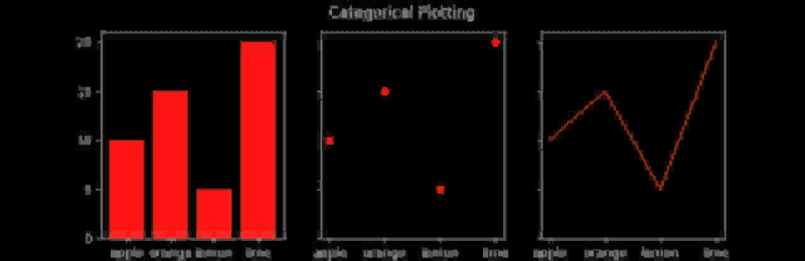
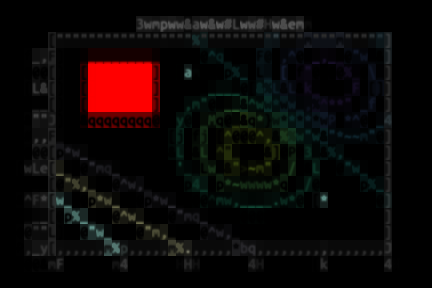
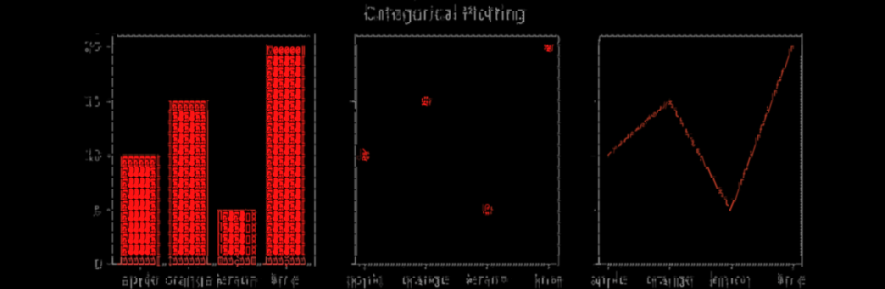
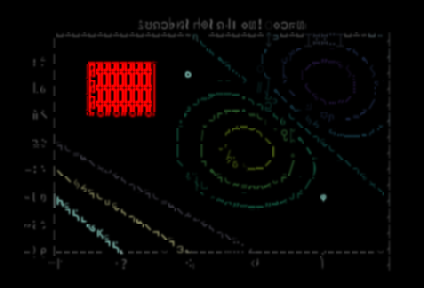
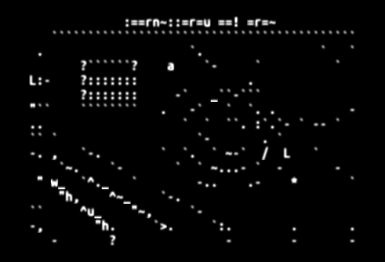

| Optimizer name | Constructor | Chars | Setup time |
| -------------- | ----------- | ----- | ---------- |
| dual/space | (SpaceDualOptimizer()) | 1 | 0.00s |
| dual/half | (HalfBlockDualOptimizer()) | 1 | 0.00s |
| dual/quad | (FastQuadDualOptimizer()) | 7 | 0.00s |
| dual/exact-block | (ExactGenericDualOptimizer("block")) | 32 | 0.04s |
| dual/fast-block | (FastGenericDualOptimizer("block")) | 32 | 0.05s |
| dual/fast-all | (FastGenericDualOptimizer()) | 4763 | 0.06s |
| dual/fast-ascii | (FastGenericDualOptimizer("ascii")) | 94 | 0.04s |
| gamma/fast-noblock | (FastGammaOptimizer(charmask="no_block")) | 4731 | 0.63s |
| gamma/exact-noblock | (ExactGammaOptimizer(charmask="no_block")) | 4731 | 0.24s |
| gamma/basic-noblock | (BasicGammaOptimizer(charmask="no_block")) | 4731 | 0.12s |
| gamma/fast-noblock-bw | (FastGammaOptimizer(charmask="no_block", use_color=False)) | 4731 | 0.63s |
| gamma/exact-ascii-bw | (ExactGammaOptimizer(charmask="ascii", use_color=False)) | 95 | 0.12s |

| Renderer | Optimizer | Time | Result |
| -------- | --------- | ---- | ------ |
| Renderer | dual/space | 0.20s |  | 
| Renderer | dual/half | 0.20s |  | 
| Renderer | dual/quad | 0.21s |  | 
| Renderer | dual/exact-block | 1.94s |  | 
| Renderer | dual/fast-block | 0.45s |  | 
| Renderer | dual/fast-all | 6.49s |  | 
| Renderer | dual/fast-ascii | 0.52s |  | 
| GammaRenderer | gamma/fast-noblock | 1.45s |  | 
| GammaRenderer | gamma/exact-noblock | 22.65s |  | 
| GammaRenderer | gamma/basic-noblock | 39.90s |  | 
| GammaRenderer | gamma/fast-noblock-bw | 0.84s |  | 
| GammaRenderer | gamma/exact-ascii-bw | 4.34s |  | 
| Renderer | dual/space | 0.02s |  | 
| Renderer | dual/half | 0.02s |  | 
| Renderer | dual/quad | 0.02s |  | 
| Renderer | dual/exact-block | 0.33s |  | 
| Renderer | dual/fast-block | 0.06s |  | 
| Renderer | dual/fast-all | 0.97s |  | 
| Renderer | dual/fast-ascii | 0.07s |  | 
| GammaRenderer | gamma/fast-noblock | 0.23s |  | 
| GammaRenderer | gamma/exact-noblock | 2.54s |  | 
| GammaRenderer | gamma/basic-noblock | 9.11s |  | 
| GammaRenderer | gamma/fast-noblock-bw | 0.13s |  | 
| GammaRenderer | gamma/exact-ascii-bw | 0.71s |  | 
